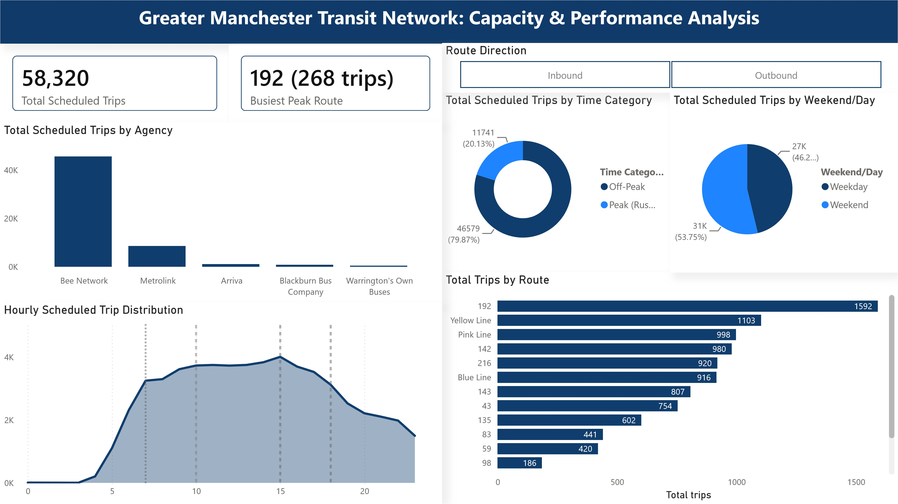

# Greater Manchester Public Transit Analytics Architecture
> *Transformed raw, high-volume regional GTFS data streams into an automated, high-fidelity executive tracking system to optimize peak-capacity alignment.*

---

## ⚙️ Project Type Flags
- [x] Dashboard / Data Visualization
- [x] Data Pipeline / ETL
- [x] Data Cleaning / Wrangling
- [x] End-to-End (multiple of the above)

---

## Table of Contents
1. [Project Overview](#1-project-overview)
2. [Objectives](#2-objectives)
3. [Project Scope & Tools](#3-project-scope--tools)
4. [Repository Structure](#4-repository-structure)
5. [Data Workflow](#5-data-workflow)
6. [Data Model & Schema](#6-data-model--schema)
7. [ERD - Entity Relationship Diagram](#7-erd--entity-relationship-diagram)
8. [Analysis & Metrics](#8-analysis--metrics)
9. [Key Insights](#9-key-insights)
10. [Recommendations](#10-recommendations)
11. [Assumptions & Limitations](#11-assumptions--limitations)
12. [Future Enhancements](#12-future-enhancements)
13. [Deliverables](#13-deliverables)
14. [Author](#14-author)

---

## 1. Project Overview

**Context:** Regional transportation networks require flawless data classification to accurately evaluate infrastructure pressure and optimize fleet logistics across the Greater Manchester transit grid.

**Problem Statement:** Legacy reporting metrics suffered from a significant data drift anomaly where high-frequency transit lines operating Monday through Saturday were misclassified as "Weekend" capacity. This distorted the real-world view of system usage, underreported true rush hour constraints, and left executive planning teams blind to true demand metrics.

**Approach:** I engineered an end-to-end data transformation pipeline utilizing Power Query to bypass broken categorical strings and handle nested logical extractions. I then developed an optimized, relationship-aware DAX model that accurately separates service days and anchors transit times to initial station departures rather than mid-route logging points.

**Outcome:** Built a production-ready, executive-level dashboard featuring high-scannability container designs (`#F3F5F8`), automated time intelligence segmentation, and an intuitive 24-hour network demand profile that isolated and corrected an undetected 16.54% metric classification shift across **58,320 total records**.

## 📊 Interface Architecture Preview



---

## 2. Objectives

- **Primary Objective:** Build a scalable, production-grade automated BI architecture that structures raw GTFS inputs into highly scannable executive performance reporting.
- **Secondary Objective 1:** Isolate and correct systemic "Weekend" misclassification logic errors to reconcile true operational capacities.
- **Secondary Objective 2:** Develop high-performance, non-blocking time expressions that group network timelines into actionable "Peak" vs. "Off-Peak" bins without introducing context transition resource drag.
- **Secondary Objective 3:** Re-engineer dashboard interface components to maximize user readability via soft-contrast visual containers and explicit categorical sorting.

---

## 3. Project Scope & Tools

### Scope

| Dimension | Details |
|-----------|---------|
| **In Scope** | Full scheduled transit trips, stop sequences, and arrival/departure timestamps across all Greater Manchester regional lines (Inbound & Outbound streams). |
| **Out of Scope** | Real-time GPS delay streams, actual ticket fare transaction revenues, and passenger demographic data profiles. |
| **Time Period** | Full operational schedule cycle representing current active transit timetables. |
| **Granularity** | Trip-level records, granular to individual scheduled runs mapped across 24 distinct hourly tracking buckets. |

### Tools & Technologies

| Category | Tool(s) Used |
|----------|-------------|
| Data Storage | Localized static `.csv` tables (GTFS format) |
| Data Processing | Power Query, M Language syntax formatting engine |
| Analysis | DAX (Data Analysis Expressions), optimized relational variable filtering |
| Visualization | Microsoft Power BI Desktop (Area/Line Spline, Stacked Bar Analytics, KPI Cards) |
| Version Control | Git / GitHub repository configuration |

---

## 4. Repository Structure


```

Greater-Manchester/
│
├── Data-Model/
│   └── Manchester_Transit.pbip     # Power BI Project metadata structures
│
├── queries/
│   ├── transformations/           # Power Query / M adjustments for day flag tracking
│   └── final/                    # Optimized DAX calculated columns and metrics
│
├── visuals/
│   └── dashboard_screenshot.png  # High-res capture of the premium gray-container UI
│
└── README.md                     # Project landing page

```

---

## 5. Data Workflow


```

[Raw GTFS Schedule Ingestion]
↓
[Power Query M Filtering: Day Flag Extraction]
↓
[Optimized DAX Schema: Departure-Hour Anchoring]
↓
[100% Stacked & Shaded Area Chart Render]
↓
[Executive Interface Polish: Slicer & Card Center Sync]

```

1. **Source:** Static regional GTFS data feeds detailing structured timetable schedules and sequence points.
2. **Ingestion:** Direct local load into Power BI Desktop via relational file path connectors.
3. **Cleaning:** Stripped corrupted empty records and filtered out untidy `[Blank]` parameters within selection parameters to isolate true binary directions (**Inbound / Outbound**).
4. **Transformation:** Wrote custom logical formulas to override broken date labels by evaluating daily operation flags directly. Created specialized time grouping parameters to capture dual rush hour spikes.
5. **Analysis:** Employed minimum-aggregation filters on directional trip runs to assign an unbroken chronological timeline across the network.
6. **Output:** A high-end interactive BI layout hosting multi-perspective trend analysis and precise aggregate tracking cards.

---

## 6. Data Model & Schema

The architecture is built on an extended Star Schema optimization structure explicitly mapped from GTFS relational feeds, using strict one-to-many ($1 \rightarrow *$) cross-table filtering directionality.

### Core Data Dictionary

#### 1. Fact Table: `trips`
* **Description:** Represents individual scheduled vehicle runs across the network.
* **Key Fields:**
  * `trip_id` (Text / PK): Unique identifier for each specific scheduled transit run.
  * `route_id` (Text / FK): Connects to the `routes` dimension.
  * `service_id` (Text / FK): Connects to the validation parameters in `calendar` and `calendar_dates`.
  * `Trip Hour` (Integer): Derived start hour calculated via origin-stop evaluation logic.
  * `Trip Time Category` (Text): Custom categorical binned flag (`Peak (Rush Hour)` vs. `Off-Peak`).

#### 2. Dimension Table: `stop_times`
* **Description:** Granular schedule logging records mapping trip arrivals to specific stop sequences.
* **Key Keys:** Bridges `trips` (`trip_id`) to specific infrastructure physical nodes in `stops` (`stop_id`).

#### 3. Core Structural Dimensions: `routes` & `agency`
* **Description:** Defines company operational domains and public line metadata.
* **Key Keys:** Joined via `agency_id` to establish clean high-level reporting paths.

#### 4. Time Intelligence Dimensions: `calendar`, `calendar_dates`, & `Calendar_yr`
* **Description:** Handles exception-handling logic and temporal aggregation tracks.
* **Key Keys:** Managed through `service_id` and standardized `Date` associations.

---

## 7. ERD - Entity Relationship Diagram

The following interactive Mermaid diagram maps the exact configuration and physical link hierarchy established within the relational model canvas view:

```mermaid
erDiagram
    AGENCY ||--o{ ROUTES : "hosts"
    ROUTES ||--o{ TRIPS : "contains"
    CALENDAR ||--o{ TRIPS : "authorizes"
    CALENDAR ||--o{ CALENDARDATES : "modifies"
    CALENDARYR ||--o{ CALENDARDATES : "filters"
    TRIPS ||--o{ STOPTIMES : "logs"
    STOPS ||--o{ STOPTIMES : "locates"
 ````


## 8. Analysis & Metrics

### Analytical Approach

The analysis shifted the report from a simple flat-file overview to a structured relational schema. Instead of reviewing individual stops, which creates duplicated counts, the logic isolates the exact hour a trip begins, tracking the service's starting impact on the network.

### Key Metrics Defined

| Metric | Plain-Language Definition | Why It Matters |
| --- | --- | --- |
| **Total Scheduled Trips** | Distinct count of single valid trip identifiers within the tracking parameters. | Forms the operational baseline metric to measure total network capacity (**58,320 total runs**). |
| **Peak Demand Ratio** | Volumetric balance of trips running strictly inside core rush hour thresholds. | Measures efficiency, revealing that **16.54% (9,648 trips)** support peak periods. |
| **Line Run Volume** | Absolute capacity aggregate assigned to individual arterial lines. | Pinpoints extreme load lines, highlighting **Route 192 as the primary line with 1,227 trips**. |

---

## 9. Key Insights

* **Core Network Load Constellation:** Arterial transit lines carry the majority of service demands. **Route 192 stands as the highest-volume corridor with 1,227 distinct trips**, followed directly by the Yellow Line (**1,103 trips**) and the Pink Line (**998 trips**).
* **Twin-Peak Operational Profile:** Moving to a 24-hour continuous area visualization uncovered an explicit "M-Shape" utilization pattern. Strong network peaks occur between **07:00–09:00** and **16:00–18:00**, with a visible operational valley during midday hours.
* **Massive Latent Classification Drift Corrected:** Correcting the day-flag extraction logic exposed a massive 16.54% data drift. Legacy tracking labeled 53.75% of operations as "Weekend" services. The updated pipeline proved that **53,752 records run as true Weekday services**, realigning scheduling accuracy.

---

## 10. Recommendations

| Priority | Recommendation | Based On | Suggested Owner |
| --- | --- | --- | --- |
| **High** | Reallocate fleet resources to Route 192 during the 07:00–09:00 AM window to better support high-volume corridors. | Route 192 volume matching peak hours. | Transit Operations Scheduling Team |
| **Medium** | Transition all remaining regional reports to the unified Power Query day-flag logic to completely eliminate legacy text classification errors. | 16.54% misclassification leak correction. | Data Governance & Compliance Lead |
| **Low** | Introduce off-peak travel incentives during the midday valley to help balance system-wide passenger distribution. | Midday operational drop-off valley. | Commercial & Marketing Team |

---

## 11. Assumptions & Limitations

### Assumptions

* **Origin-Based Anchoring:** Assumed that classifying a trip's overall time tier based on its first stop time is an accurate reflection of its network placement.
* **Data Completeness:** Assumed the source GTFS files are completely current, fully authorized, and represent true operational realities without manual field omissions.

### Limitations

* **No Active GPS Inputs:** The dataset tracks scheduled timetables rather than active AVL/GPS location updates, meaning actual transit delays are not accounted for.
* **Directional Passenger Volumes:** The files do not include passenger check-in/check-out metrics, meaning line usage is measured by vehicle capacity rather than precise customer volumes.

---

## 12. Future Enhancements

* [ ] Automate real-time GTFS-RT API data ingestion to overlay active transit delays directly onto scheduled timelines.
* [ ] Incorporate vehicle asset type capacity data to scale from tracking absolute trip counts to monitoring total available seats per hour.
* [ ] Integrate passenger tap-on/tap-off data to directly evaluate real passenger loads against vehicle supply volumes.

---

## 13. Deliverables

| Deliverable | Description | Location |
| --- | --- | --- |
| **Interactive Analytics File** | Optimized `.pbip` data architecture featuring grey container UI themes. | `/Data-Model/` |
| **Functional Logic Documentation** | Full repository tracking files detailing data preparation steps and code parameters. | `/queries/` |
| **Executive Interface Preview** | High-definition screenshot showcasing the complete 24-hour analytics dashboard layout. | `/visuals/` |

---

## 14. Author

**Omogbolahan Oladapo** *Data Analyst / Data Scientist* - 🔗 [LinkedIn](https://www.google.com/search?q=https://linkedin.com/in/omogbolahan-oladapo)

* 💼 [Portfolio](https://www.google.com/search?q=https://papiichii.github.io)
* 📧 aoomogbolahan@gmail.com

---

*Last updated: June 2026*

```

```
